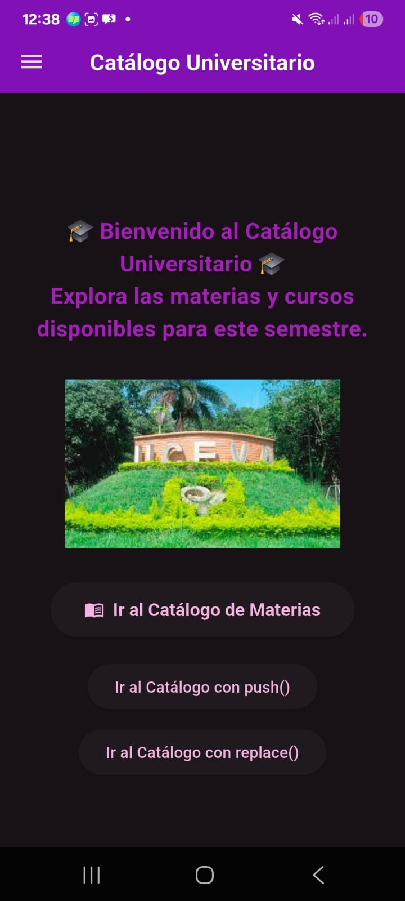
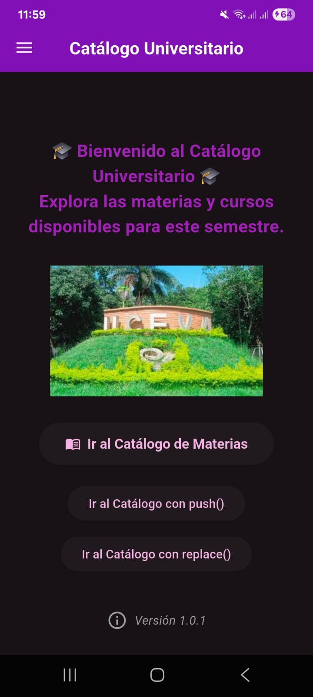

# 🐾 Catálogo Universitario - Distribución y Versionado de App Flutter 

**Autora:** Angie Natalia Cobo Vásquez  
**Código:** 230222011  
**Repositorio:** [https://github.com/Angie-Natalia-Cobo-Vasquez/TalleresMoviles](https://github.com/Angie-Natalia-Cobo-Vasquez/TalleresMoviles)  
**Materia:** Desarrollo Móvil - 7° Semestre  
**Institución:** Unidad Central del Valle (UCEVA)  
**📅 Fecha:** Octubre 2025  

---

## 🚀 Módulo: Distribución de Aplicaciones Flutter con Firebase App Distribution

Este módulo corresponde a la **versión 1.0.1** del proyecto, enfocada en el proceso de **generación, distribución y versionado** de la aplicación móvil, aplicando buenas prácticas con **Semantic Versioning** y **Firebase App Distribution**.

---

## 📦 Flujo de Distribución

🏗️ Build → 🚀 Distribución en Firebase → 👥 Testers → 📲 Instalación → 🔄 Actualización

### **1️⃣ Generar APK**
```bash
flutter build apk --release
```
📍 **Ruta del archivo generado:**  
`build/app/outputs/flutter-apk/app-release.apk`

---

### **2️⃣ Distribución en Firebase**
1. Ingresar a [Firebase Console](https://console.firebase.google.com/)  
2. Seleccionar el proyecto vinculado  
3. Acceder a **App Distribution**  
4. Subir `app-release.apk`  
5. Añadir notas de lanzamiento  
6. Invitar testers vía correo  

🧪 **Los testers reciben:**
- Correo con invitación desde Firebase  
- Link directo para descargar la app  
- Instrucciones de instalación  

---

## ⚙️ Configuración Android para Distribución

### 1. **Permisos en `AndroidManifest.xml`**
```xml
<uses-permission android:name="android.permission.INTERNET"/>
<uses-permission android:name="android.permission.ACCESS_NETWORK_STATE"/>
<uses-permission android:name="android.permission.ACCESS_WIFI_STATE"/>
<uses-permission android:name="android.permission.CHANGE_NETWORK_STATE"/>
```

---

### 2. **Logo de la Aplicación**
Logo generado en 5 resoluciones:

- `mipmap-mdpi/ic_launcher.png` (48x48px)  
- `mipmap-hdpi/ic_launcher.png` (72x72px)  
- `mipmap-xhdpi/ic_launcher.png` (96x96px)  
- `mipmap-xxhdpi/ic_launcher.png` (144x144px)  
- `mipmap-xxxhdpi/ic_launcher.png` (192x192px)

---

### 3. **Configuración Firebase**

**Archivo:** `android/build.gradle.kts`
```kotlin
plugins {
    id("com.google.gms.google-services") version "4.4.4" apply false
}
```

**Archivo:** `android/app/build.gradle.kts`
```kotlin
plugins {
    id("com.google.gms.google-services")
}
```

📍 **Archivo `google-services.json` ubicado en:**  
`android/app/` *(nivel general del proyecto)*

---

## 🧩 Versionado Semántico

Formato:
```
MAJOR.MINOR.PATCH
```
Ejemplo: **1.0.1**  
- **MAJOR** → Cambios incompatibles  
- **MINOR** → Nuevas funciones  
- **PATCH** → Correcciones o mejoras menores  

### Configuración en `build.gradle.kts`
```kotlin
defaultConfig {
    applicationId = "com.example.catalogo_universitario"
    versionCode = 1000002
    versionName = "1.0.1"
}
```

---

## 📝 Release Notes – v1.0.1

### ✨ Novedades
- 🔧 Configuración de **Firebase App Distribution**
- 🧱 Generación de **APK en modo Release**
- 📦 Implementación de **versionado semántico**
- 🧪 Pruebas de instalación en dispositivo físico exitosas

### 🐛 Correcciones
- Ajustes en dependencias y estructura del proyecto  
- Optimización del tamaño de build  

### ✅ Estado
- **Versión probada y funcional**  
- **Distribución completada en Firebase App Distribution**  

---

## ✅ Checklist de Revisión antes del Release
- [x] `versionCode` y `versionName` actualizados  
- [x] APK generado en modo `--release`  
- [x] Firebase configurado correctamente  
- [x] App instalada y probada en Android físico  
- [x] README actualizado con versión y proceso  

---

## 📊 Arquitectura del Proyecto

```
lib/
├── models/
├── services/
├── views/
└── main.dart
```

### 🔍 Tecnologías Utilizadas
- **Flutter SDK:** 3.10.0+  
- **Dart:** 3.10.0+  
- **Firebase App Distribution**  
- **Material Design 3**  
- **HTTP Package**  
- **GoRouter**  

---

---

## 📸 Capturas del Proyecto

### Versiones




---

## 🧠 Conclusión

Con esta versión, se logró dominar el proceso completo de **construcción, empaquetado y distribución** de aplicaciones Flutter a través de **Firebase App Distribution**, consolidando conocimientos sobre control de versiones, publicación y pruebas en entorno real.

---

## 📦 Versión Actual
**Versión:** `1.0.1`  
**Build:** `1000002`  
**Estado:** ✅ Distribuida exitosamente  
**Última actualización:** Octubre 2025
