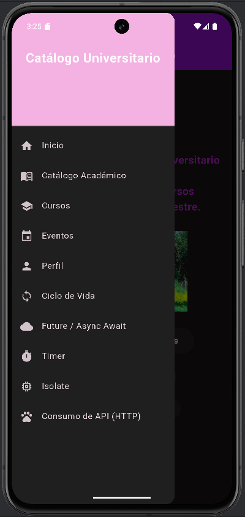
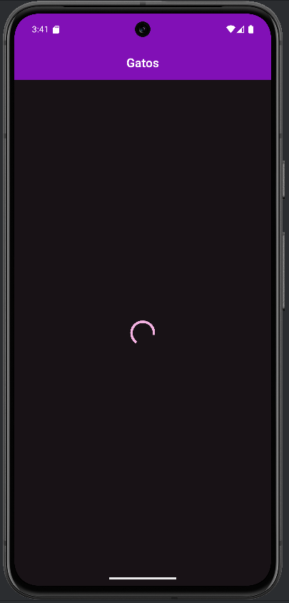
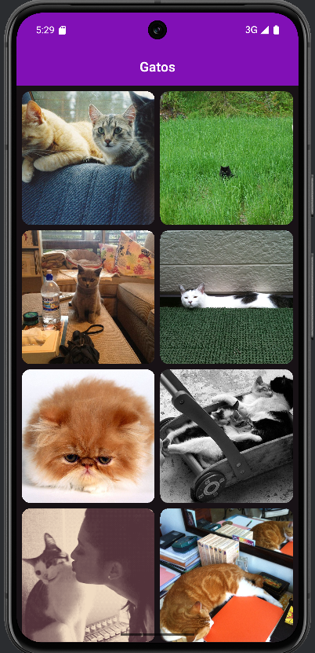
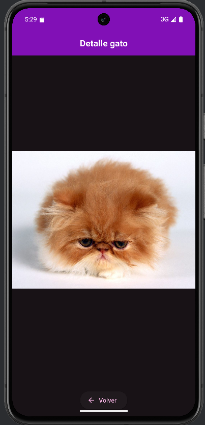
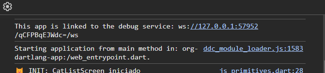
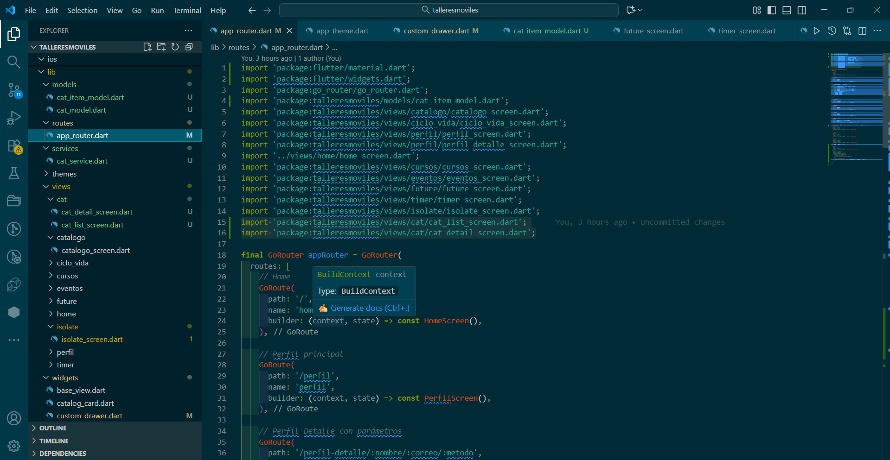

# 🐾 Catálogo Universitario - Módulo HTTP y APIs

**Autora:** Angie Natalia Cobo Vásquez  
**Código:** 230222011  
**Repositorio:** [https://github.com/Angie-Natalia-Cobo-Vasquez/TalleresMoviles](https://github.com/Angie-Natalia-Cobo-Vasquez/TalleresMoviles)

---

## 🚀 Módulo: Consumo de API HTTP

---

## 📱 Funcionalidades Implementadas

### 1️⃣ Pantalla Principal - Listado de Gatos
- Realiza petición **GET** a [TheCatAPI](https://thecatapi.com)
- Renderiza resultados con **`GridView.builder`**
- Muestra imágenes y nombres de razas de gatos
- Estados de interfaz:
  - ⏳ **Cargando**
  - ✅ **Éxito**
  - ❌ **Error**

---

### 2️⃣ Navegación con GoRouter
- Ruta `/cat` → **Listado de gatos**
- Ruta `/cat/detail` → **Pantalla de detalle**
- Paso de parámetros mediante `state.extra`
- Navegación fluida con **animaciones Hero**

---

## 🌐 API Utilizada

**TheCatAPI** — Servicio público para obtener imágenes e información de razas de gatos.  

📍 **Endpoint principal:**  
`https://api.thecatapi.com/v1/images/search?limit=20`

📦 **Ejemplo de respuesta JSON:**
```json
[
  {
    "id": "MTY3ODIyMQ",
    "url": "https://cdn2.thecatapi.com/images/MTY3ODIyMQ.jpg",
    "breeds": [
      {
        "name": "Abyssinian"
      }
    ]
  }
]
```

---

## 🏗️ Arquitectura del Proyecto

```plaintext
lib/
├── models/
│   ├── cat_item_model.dart    # Modelo para items de gatos
│   └── cat_model.dart         # Modelo para razas de gatos
├── services/
│   └── cat_service.dart       # Servicio para peticiones HTTP
└── views/
    └── cat/
        ├── cat_list_screen.dart    # Pantalla de listado
        └── cat_detail_screen.dart  # Pantalla de detalle
```

---

## 🧩 Servicio HTTP y Modelo de Datos

### 🧠 Archivo: `cat_service.dart`

```dart
import 'package:http/http.dart' as http;
import 'dart:convert';
import '../models/cat_item_model.dart';

class CatService {
  Future<List<CatItem>> fetchCatImages() async {
    final url = Uri.parse('https://api.thecatapi.com/v1/images/search?limit=20');
    final response = await http.get(url);

    if (response.statusCode == 200) {
      final List data = json.decode(response.body);
      return data.map((json) => CatItem.fromJson(json)).toList();
    } else {
      throw Exception('Error al obtener las imágenes de gatos');
    }
  }
}
```

---

### 🐱 Archivo: `cat_item_model.dart`

```dart
class CatItem {
  final String id;
  final String imageUrl;
  final String breedName;

  CatItem({
    required this.id,
    required this.imageUrl,
    required this.breedName,
  });

  factory CatItem.fromJson(Map<String, dynamic> json) {
    return CatItem(
      id: json['id'] ?? '',
      imageUrl: json['url'] ?? '',
      breedName: (json['breeds'] != null && json['breeds'].isNotEmpty)
          ? json['breeds'][0]['name']
          : 'Desconocido',
    );
  }
}
```

---

## 📸 Capturas del Proyecto

### 🐾 Interfaz del Listado y Detalle de Gatos








---

## ✅ Conclusión

Este módulo permitió implementar de manera práctica el **consumo de APIs en Flutter**, integrando desde la solicitud HTTP hasta la visualización de datos.  
Se reforzaron conceptos clave como el **manejo de estados (cargando/éxito/error)**, la **navegación con GoRouter**, y la **estructuración modular del código (Service / Model / View)**, logrando una aplicación funcional y escalable.
