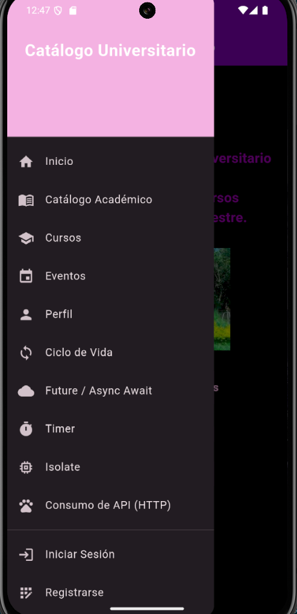
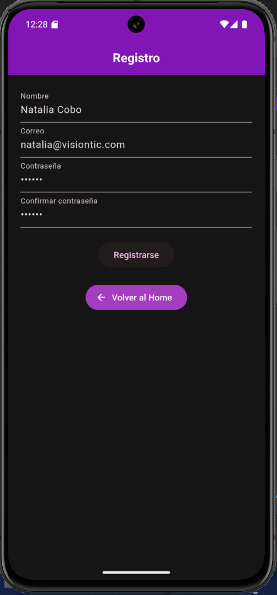
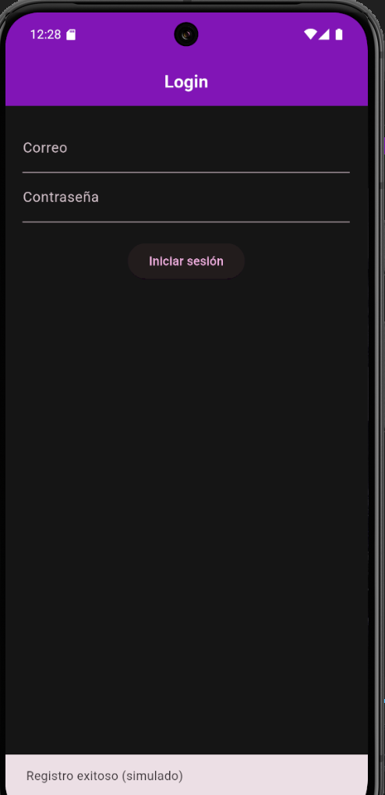
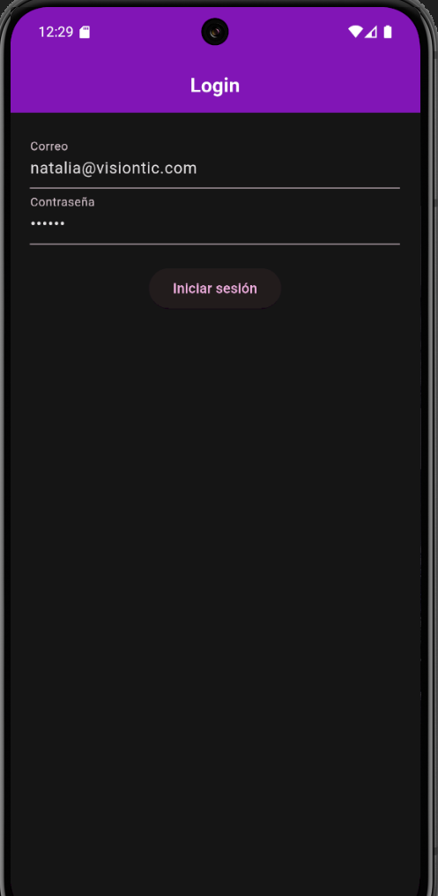
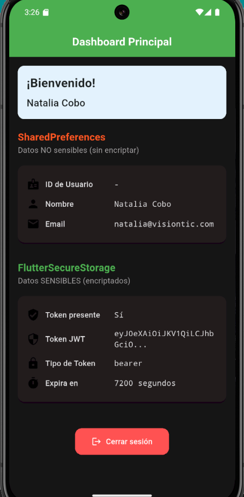

# 🔐 Taller 2 – Autenticación JWT en Flutter

**Autora:** Angie Natalia Cobo Vásquez  
**Código:** 230222011  
**Repositorio:** [https://github.com/Angie-Natalia-Cobo-Vasquez/TalleresMoviles](https://github.com/Angie-Natalia-Cobo-Vasquez/TalleresMoviles)  
**Materia:** Desarrollo Móvil - 7° Semestre  
**Institución:** Unidad Central del Valle (UCEVA)  
**📅 Fecha:** Octubre 2025  

---

## 🚀 Módulo: Autenticación JWT con Manejo de Estado y Almacenamiento Seguro

Este taller corresponde al **Taller 2**, enfocado en la **implementación de autenticación JWT**, **manejo de estados**, **persistencia local** y **buenas prácticas de arquitectura en Flutter**.

---

## 🎯 Objetivo del Taller

Desarrollar un módulo que permita:

1. 🔑 **Realizar login JWT** contra un backend (propio o API pública).  
2. ⚙️ Implementar **manejo de estados** (cargando / éxito / error).  
3. 🧩 Aplicar **separación lógica por servicios** y buenas prácticas de arquitectura.  
4. 💾 Guardar información de usuario en `shared_preferences` (no sensible).  
5. 🔐 Guardar tokens JWT en `flutter_secure_storage` (información sensible).  
6. 🖥️ Crear una vista de evidencia que muestre los datos almacenados localmente.

---

## 🧱 Arquitectura y Flujo del Proyecto

```
lib/
├── models/                # Modelos de datos (Usuario, LoginResponse, etc.)
├── services/              # Lógica de negocio y conexión API (AuthService, ApiClient)
├── providers/             # Manejo de estado (Provider)
├── views/                 # Vistas de UI (LoginScreen, EvidenciaScreen)
└── main.dart              # Punto de entrada del proyecto
```

---

## 🔗 Autenticación JWT

### ✅ Opción Implementada
Se usó la **API pública de Parking Visiontic**, con los endpoints documentados en Swagger:

📄 [https://parking.visiontic.com.co/api/documentation](https://parking.visiontic.com.co/api/documentation)

**Endpoint principal (login):**
```
POST https://parking.visiontic.com.co/api/login
```

### 📥 Flujo del Login

1. El usuario ingresa sus credenciales.  
2. El sistema realiza la petición HTTP al endpoint de login.  
3. La respuesta contiene un token JWT, almacenado de forma segura.  
4. Se guarda información del usuario (nombre, correo) en `shared_preferences`.  
5. Se redirige a la vista de evidencia con los datos persistidos.

---

## 💾 Almacenamiento Local

| Tipo | Herramienta | Datos | Descripción |
|------|--------------|-------|--------------|
| No sensible | shared_preferences | nombre, email, tema | Persistencia básica |
| Sensible | flutter_secure_storage | access_token, refresh_token | Seguridad de credenciales |

---

## 🧩 Vista de Evidencia

### Funcionalidades:
- Mostrar nombre y correo (desde `shared_preferences`).  
- Indicar si hay token almacenado (`flutter_secure_storage`).  
- Botón **“Cerrar sesión”** que borra los datos guardados.  

📸 **Capturas de evidencia** *(se agregarán posteriormente)*

---

## ⚙️ Flujo de Trabajo con GitFlow

| Rama | Propósito |
|------|------------|
| `main` | Versión estable del proyecto |
| `dev` | Rama base de desarrollo |
| `feature/taller_jwt` | Implementación del taller JWT |

### 🔄 Proceso
1. Crear rama `feature/taller_jwt` desde `dev`.  
2. Implementar autenticación JWT y vista de evidencia.  
3. Abrir PR `feature/taller_jwt → dev`.  
4. Revisar, aprobar y hacer merge a `dev` y luego a `main`.

---

## 🧠 Manejo de Estados

Se implementó el patrón **Provider**, gestionando tres estados principales:

- `loading`: cuando se realiza la petición al servidor  
- `success`: cuando la autenticación es correcta  
- `error`: cuando ocurre un fallo (credenciales o conexión)

---

## 🧾 Ejemplo de Configuración

### Dependencias principales
```yaml
dependencies:
  flutter:
    sdk: flutter
  http: ^1.1.0
  provider: ^6.0.5
  shared_preferences: ^2.2.2
  flutter_secure_storage: ^9.0.0
```

### Lógica básica de login
```dart
final response = await http.post(
  Uri.parse("https://parking.visiontic.com.co/api/login"),
  body: {"email": email, "password": password},
);
```

---

## 🧪 Evidencias del Taller

📄 Se entregó un **PDF** con capturas que muestran:
- El consumo exitoso del endpoint de login.  
- Los datos almacenados localmente (`shared_preferences` y `secure_storage`).  
- La funcionalidad de cierre de sesión.  

---

## 🧱 Tecnologías Utilizadas
- **Flutter SDK:** 3.10.0+  
- **Dart:** 3.10.0+  
- **Provider (estado)**  
- **HTTP Package (API REST)**  
- **shared_preferences / flutter_secure_storage**  
- **Material Design 3**  

---

## 🧩 Release Notes – Taller JWT

### ✨ Novedades
- Implementación completa de autenticación JWT.  
- Manejo de estado con Provider.  
- Persistencia local de datos y tokens.  
- Vista de evidencia funcional y validada.  

### 🐛 Correcciones
- Ajuste de dependencias y estructura modular del proyecto.  
- Corrección en manejo de errores y estados del login.

### ✅ Estado
- **Versión probada y funcional.**  
- **Cumple con los requisitos del Taller 2.**

---

## 📸 Capturas del Proyecto

### Versiones






---


## 🧠 Conclusión

Con este taller se consolidaron los conocimientos sobre **autenticación JWT en Flutter**, **gestión de estado**, **seguridad local** y **flujo de trabajo con GitFlow**, aplicando prácticas de desarrollo profesional y distribución organizada del código.

---

## 📦 Versión Actual
**Versión:** `2.0.0`  
**Rama:** `feature/taller_jwt`  
**Estado:** ✅ Finalizado y probado  
**Última actualización:** Octubre 2025
