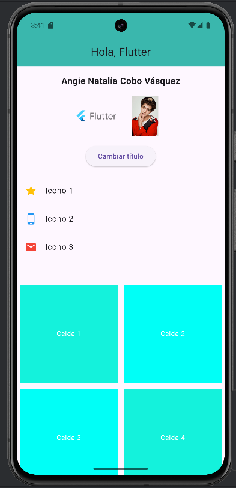
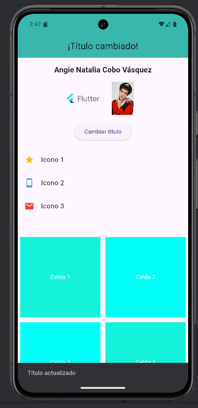

# Taller 1 – Flutter + Widgets

**Nombre completo:** Angie Natalia Cobo Vásquez  
**Materia:** Desarrollo de aplicaciones móviles  
**Código:** 230222011  
**Grupo:** 2

---

## 📝 Descripción

Este es el primer taller de la materia **Desarrollo de Aplicaciones Móviles**.  
El objetivo fue crear una pantalla sencilla usando Flutter y poner en práctica conceptos como `StatefulWidget`, `setState()`, y algunos widgets adicionales. Además, se trabajó bajo el flujo de control de versiones **GitFlow**, utilizando ramas para mantener organizado el desarrollo.

---

## 🧪 Requisitos cumplidos

- Pantalla con `AppBar` y título dinámico.  
- Imagen cargada desde la red (`Image.network`).  
- Imagen local (`Image.asset`).  
- Botón que cambia el título usando `setState()` y muestra un `SnackBar`.  
- Uso de widgets adicionales como `ListView` y `Container`.  
- Diseño con `Column`, `Padding`, `SizedBox`, etc.  
- Uso correcto de ramas: `feature/taller1`, `dev`, `main`.

---

## 🚀 Pasos para ejecutar el proyecto

1. Clonar el repositorio y cambiar al proyecto, cambiar de rama, instalar dependencias y ejecutar la app:

```bash
git clone https://github.com/Angie-Natalia-Cobo-Vasquez/TalleresMoviles.git
cd TalleresMoviles
git checkout feature/taller1
flutter pub get
flutter run

---

## 📸 Evidencias de ejecución

**Estado inicial:**


**Después de presionar el botón:**

