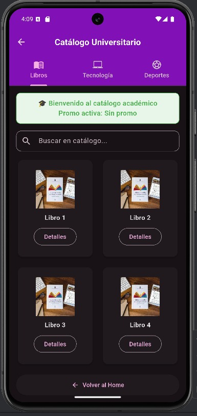
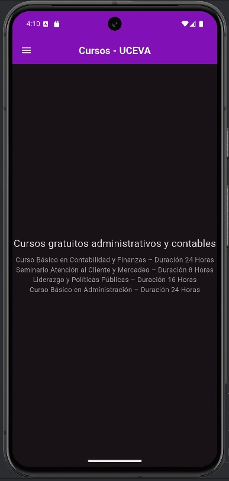
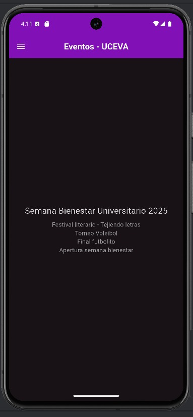
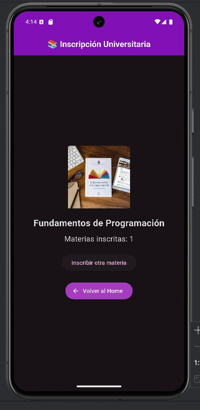
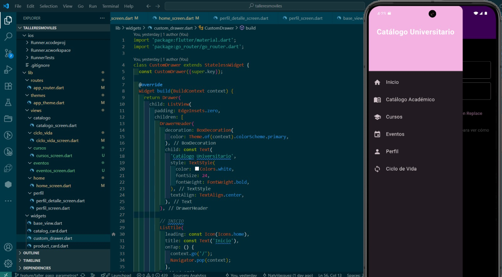

# 📘 Catálogo Universitario  
**Autora:** Angie Cobo  
**Código:** 230222011  

---

## 📖 Descripción del Proyecto  
Este proyecto es una aplicación móvil desarrollada en **Flutter**, cuyo propósito es simular un **catálogo universitario**. La app permite navegar entre diferentes categorías (Libros, Tecnología, Deportes), visualizar productos y acceder a una vista de detalles.  

La aplicación está diseñada con un enfoque académico, utilizando widgets y rutas que reflejan conceptos de **navegación, parámetros y componentes reutilizables** en Flutter.  

---

## 🏗️ Arquitectura y Navegación  

El proyecto utiliza **`go_router`** como gestor de rutas.  

### Rutas principales:
- `/` → Pantalla **Home** (bienvenida y acceso al catálogo).  
- `/catalogo` → Pantalla **Catálogo Universitario**.  
  - Soporta parámetro opcional `promo` (ejemplo: `/catalogo?promo=20%off`).  
- `/ciclo-vida` → Pantalla de detalles de un producto.  

### Flujo de navegación:
1. El usuario inicia en la pantalla Home.  
2. Puede abrir el menú lateral (**CustomDrawer**) y acceder al **Catálogo**.  
3. Dentro del Catálogo:
   - Existen 3 pestañas con categorías: **Libros**, **Tecnología**, **Deportes**.  
   - Cada tarjeta (producto) abre una nueva pantalla con más detalles.  
4. El botón **Volver al Home** y el ícono de retroceso aplican navegación inteligente (`pop` o `go('/')`).  

---

## 🧩 Widgets Usados y Razones de Elección  

- **`Scaffold`**: estructura principal de cada pantalla, con AppBar, Drawer y cuerpo.  
- **`AppBar` + `TabBar`**: permiten navegar entre categorías del catálogo de forma clara y organizada.  
- **`Drawer` (CustomDrawer)**: navegación lateral reutilizable en todas las pantallas.  
- **`GridView.builder`**: muestra productos en formato de catálogo con dos columnas.  
- **`Card` (CatalogCard)**: cada producto está encapsulado en un widget reutilizable con título, imagen y botón de detalles.  
- **`Image.asset`**: carga imágenes locales desde `assets/images`.  
- **`TextField`**: barra de búsqueda de productos en el catálogo (no funcional aún, pero muestra intención de filtrado).  
- **`ElevatedButton.icon`**: botón estilizado para regresar al Home con ícono y texto.  
- **`OutlinedButton`**: dentro de cada producto, usado para ver detalles, dando contraste con el Card.  
- **`DefaultTabController` + `TabBarView`**: facilitan la organización de categorías en pestañas.  

---

## 🚀 Tecnologías Usadas  

- **Flutter 3.x**  
- **Dart**  
- **go_router** (gestión de rutas declarativas)  
- **Material Design Widgets**  

---

## 📷 Capturas de Pantalla  

**🏠 Pantalla Home:**  

**📚 Pantalla Catálogo:**  

**📄 Pantalla de Cursos:**  

**🖥️ Pantalla de Eventos:**  

**🖥️ Pantalla de Ciclo de vida:**  

**🖥️ Pantalla de perfil académico:**  

**🖥️ Pantalla de menú lateral del catálogo universitario:**  

---

## ✅ Conclusión  

En este proyecto implemento:  
- **Navegación declarativa con parámetros.**  
- **Widgets reutilizables como: CatalogCard, CustomDrawer.**  
- **La organización de carpetas y assets.**  

