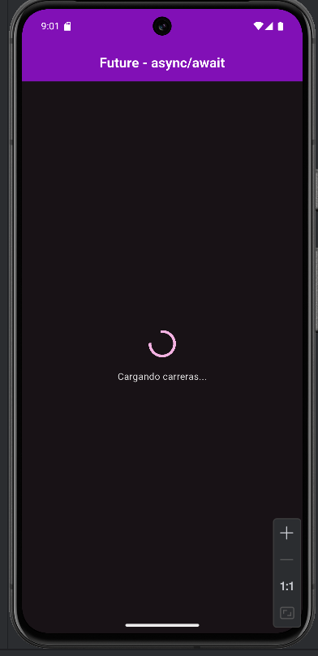
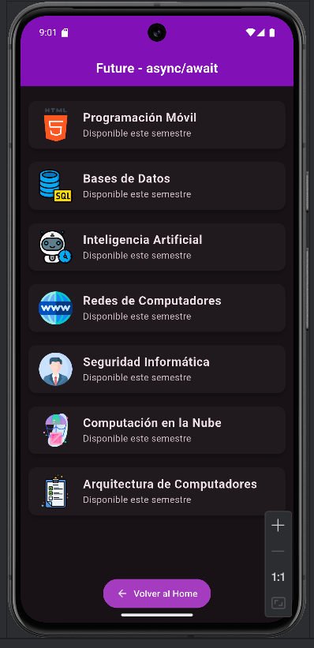
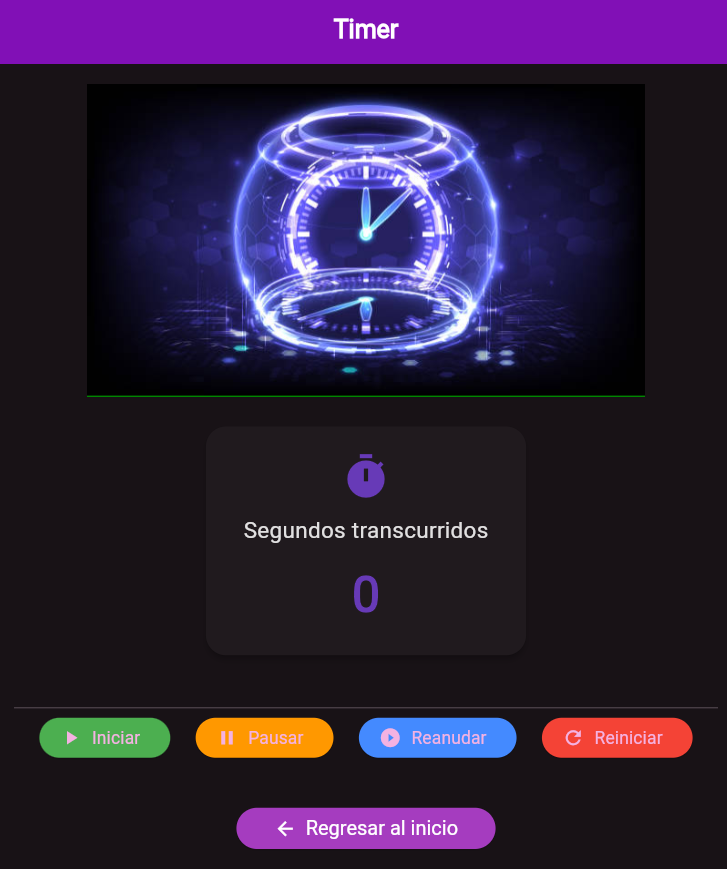
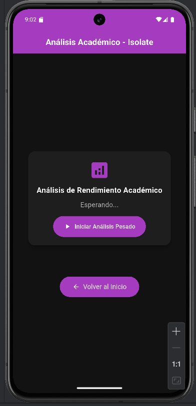
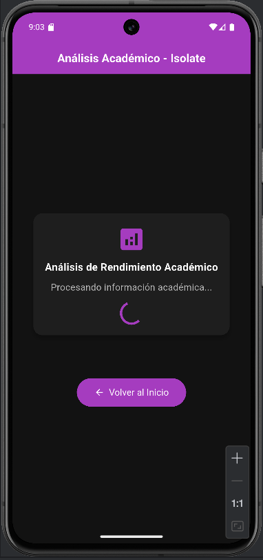
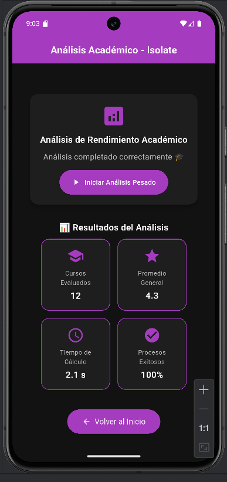

# 📘 Catálogo Universitario  
**Autora:** Angie Cobo  
**Código:** 230222011  

---

## 📖 Descripción del Proyecto  
Este proyecto es una aplicación móvil desarrollada en **Flutter**, cuyo propósito es simular un **catálogo universitario**. La app permite navegar entre diferentes categorías (Libros, Tecnología, Deportes), visualizar productos y acceder a una vista de detalles.  

La aplicación está diseñada con un enfoque académico, utilizando widgets y rutas que reflejan conceptos de **navegación, parámetros y componentes reutilizables** en Flutter.  

---

## 🏗️ Arquitectura y Navegación  

El proyecto utiliza **`go_router`** como gestor de rutas.  

### Rutas principales:
- `/` → Pantalla **Home** (bienvenida y acceso al catálogo).  
- `/catalogo` → Pantalla **Catálogo Universitario**.  
  - Soporta parámetro opcional `promo` (ejemplo: `/catalogo?promo=20%off`).  
- `/ciclo-vida` → Pantalla de detalles de un producto.  

### Flujo de navegación:
1. El usuario inicia en la pantalla Home.  
2. Puede abrir el menú lateral (**CustomDrawer**) y acceder al **Catálogo**.  
3. Dentro del Catálogo:
   - Existen 3 pestañas con categorías: **Libros**, **Tecnología**, **Deportes**.  
   - Cada tarjeta (producto) abre una nueva pantalla con más detalles.  
4. El botón **Volver al Home** y el ícono de retroceso aplican navegación inteligente (`pop` o `go('/')`).  

---

## 🧩 Widgets Usados y Razones de Elección  

- **`Scaffold`**: estructura principal de cada pantalla, con AppBar, Drawer y cuerpo.  
- **`AppBar` + `TabBar`**: permiten navegar entre categorías del catálogo de forma clara y organizada.  
- **`Drawer` (CustomDrawer)**: navegación lateral reutilizable en todas las pantallas.  
- **`GridView.builder`**: muestra productos en formato de catálogo con dos columnas.  
- **`Card` (CatalogCard)**: cada producto está encapsulado en un widget reutilizable con título, imagen y botón de detalles.  
- **`Image.asset`**: carga imágenes locales desde `assets/images`.  
- **`TextField`**: barra de búsqueda de productos en el catálogo (no funcional aún, pero muestra intención de filtrado).  
- **`ElevatedButton.icon`**: botón estilizado para regresar al Home con ícono y texto.  
- **`OutlinedButton`**: dentro de cada producto, usado para ver detalles, dando contraste con el Card.  
- **`DefaultTabController` + `TabBarView`**: facilitan la organización de categorías en pestañas.  

---

## 🚀 Tecnologías Usadas  

- **Flutter 3.x**  
- **Dart**  
- **go_router** (gestión de rutas declarativas)  
- **Material Design Widgets**  

---

## 📷 Capturas de Pantalla  

**🏠 Pantalla Home:**  


**📚 Pantalla Catálogo:**  


**📄 Pantalla de Cursos:**  


**🖥️ Pantalla de Eventos:**  


**🖥️ Pantalla de Ciclo de vida:**  


**🖥️ Pantalla de perfil académico:**  


**🖥️ Pantalla de menú lateral del catálogo universitario:**  


**🖥️ Pantalla de Carga del Future**  


**🖥️ Pantalla del Resultado de Future**  


**🖥️ Pantalla de Timer**  


**🖥️ Pantalla inicial de Isolate**


**🖥️ Pantalla durante el proceso de carga**


**🖥️ Pantalla con análisis completado**  


---

## ✅ Conclusión  

En este proyecto implemento:  
- **Navegación declarativa con parámetros.**  
- **Widgets reutilizables como: CatalogCard, CustomDrawer.**  
- **La organización de carpetas y assets.**  

---

## ⚙️ Documentación Técnica: Manejo de Procesos Asíncronos  

```dart
// En esta sección se explica el uso de Future, async/await, Timer e Isolate
// Estos permiten manejar tareas que tardan o requieren ejecución paralela
// sin bloquear la interfaz de usuario.

// 🧭 Future
// Se utiliza cuando una tarea tarda un tiempo en completarse.
// Ideal para operaciones que deben esperar, como peticiones a APIs o simulaciones.

Future<String> cargarDatos() async {
  await Future.delayed(Duration(seconds: 2)); // Simula una espera de 2 segundos
  return "Datos cargados correctamente";
}

// ⚙️ async / await
// 'async' marca una función como asíncrona.
// 'await' pausa la ejecución hasta que el Future termine, sin congelar la app.

void obtenerInformacion() async {
  print("Cargando información...");
  String resultado = await cargarDatos();
  print(resultado);
}

// ⏰ Timer
// Se usa para ejecutar algo después de cierto tiempo o repetidamente.
// Ideal para cronómetros, animaciones o tareas periódicas.

void iniciarCronometro() {
  int segundos = 0;
  Timer.periodic(Duration(seconds: 1), (timer) {
    segundos++;
    print("Tiempo transcurrido: $segundos segundos");

    if (segundos == 5) {
      timer.cancel(); // Detiene el cronómetro
      print("Cronómetro detenido.");
    }
  });
}

// 🧵 Isolate
// Se usa para tareas muy pesadas que podrían trabar la interfaz.
// Permite ejecutar el código en un hilo separado.

import 'dart:isolate';

void procesoPesado(SendPort sendPort) {
  int resultado = 0;
  for (int i = 0; i < 100000000; i++) {
    resultado += i;
  }
  sendPort.send(resultado);
}

void ejecutarIsolate() async {
  ReceivePort receivePort = ReceivePort();
  await Isolate.spawn(procesoPesado, receivePort.sendPort);

  receivePort.listen((mensaje) {
    print("Resultado del proceso pesado: $mensaje");
  });
}

```plaintext
🗺️ DIAGRAMA / LISTA DE PANTALLAS Y FLUJOS

Pantalla Home
   │
   ├──> Menú Lateral (CustomDrawer)
   │        ├──> Catálogo Universitario
   │        │       ├──> Libros
   │        │       ├──> Tecnología
   │        │       └──> Deportes
   │        │
   │        └──> Ciclo de Vida (cronómetro y proceso pesado)
   │
   └──> Perfil Académico / Cursos / Eventos


FLUJO DEL CRONÓMETRO Y PROCESO PESADO

Usuario entra a "Ciclo de Vida"
       ↓
Se inicia un Timer → cuenta segundos (cronómetro)
       ↓
Se ejecuta un Future con async/await para simular carga
       ↓
Si la tarea es pesada → se ejecuta con un Isolate
       ↓
Al terminar → se muestra el resultado o mensaje en pantalla

